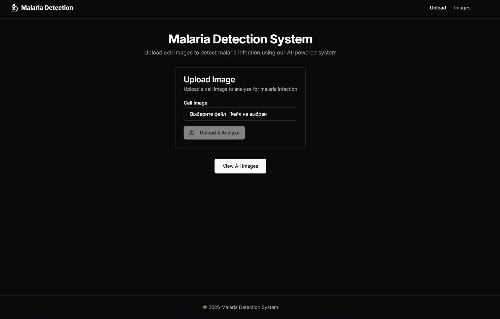
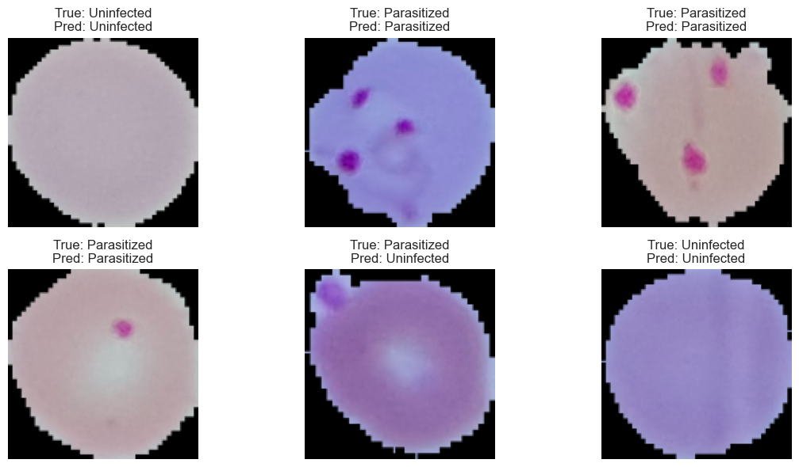
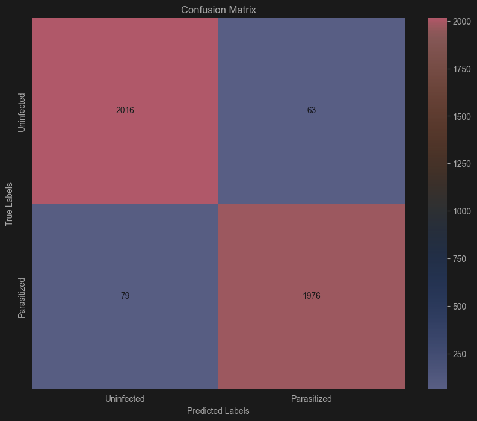

# 🦠 Malaria Detection System - AI-Powered Cell Image Analysis

A full-stack web application for detecting malaria infection from blood cell images using a Convolutional Neural Network (CNN). The system provides automated analysis of microscopic cell images to identify infected and uninfected cells, reducing diagnostic time and workload for medical professionals.

---

## 📋 Table of Contents

- [Overview](#overview)
- [Architecture](#architecture)
- [Tech Stack](#tech-stack)
- [Getting Started](#getting-started)
  - [Prerequisites](#prerequisites)
  - [AI Model Setup](#ai-model-setup)
  - [Backend Setup](#backend-setup)
  - [Frontend Setup](#frontend-setup)
- [Environment Variables](#environment-variables)
- [Usage Examples](#usage-examples)
- [API Documentation](#api-documentation)
- [Model Performance](#model-performance)
- [Project Structure](#project-structure)
- [Contributing](#contributing)
- [License](#license)

---

## 🔍 Overview

The Malaria Detection System is an AI-powered diagnostic tool that analyzes blood smear cell images to detect malaria infection. The system provides:

- **AI-Powered Detection**: Convolutional Neural Network (CNN) model trained to classify cells as infected or uninfected
- **Image Upload Interface**: Easy-to-use web interface for uploading cell images
- **Real-time Analysis**: Instant prediction results with confidence scores
- **Image History**: View all previously analyzed images with their results
- **REST API**: FastAPI backend for seamless integration with other systems

---

## 🏗️ Architecture

The application follows a three-tier architecture:

```
┌─────────────────┐         ┌─────────────────┐         ┌─────────────────┐
│                 │  HTTP   │                 │         │                 │
│   Next.js       │◄───────►│  FastAPI Server │◄───────►│   SQLite        │
│   Frontend      │         │   (Python)      │         │   Database      │
│                 │         │                 │         │                 │
└─────────────────┘         └────────┬────────┘         └─────────────────┘
                                     │
                                     ▼
                            ┌─────────────────┐
                            │   TensorFlow    │
                            │   CNN Model     │
                            └─────────────────┘
```

### How Components Interact:

1. **Frontend → Backend (REST API)**: The Next.js client sends cell images to FastAPI endpoints for prediction
2. **Backend → CNN Model**: Uploaded images are preprocessed and fed to the trained TensorFlow model
3. **Backend → Database**: Prediction results are stored in SQLite database for history tracking
4. **Frontend ← Backend**: Results (infected/uninfected) are returned and displayed to the user

---

## 🛠️ Tech Stack

### AI Model (`ai_model_final/`)

| Technology | Purpose |
|------------|---------|
| **TensorFlow/Keras** | Deep learning framework for CNN model |
| **OpenCV** | Image preprocessing and manipulation |
| **NumPy** | Numerical operations on image arrays |
| **Scikit-learn** | Model evaluation metrics |
| **Matplotlib/Seaborn** | Training visualization and metrics plots |
| **KaggleHub** | Dataset download and management |

### Backend (`ai_api_final/`)

| Technology | Purpose |
|------------|---------|
| **FastAPI** | Modern, fast web framework for building APIs |
| **SQLAlchemy 2.0** | Async ORM for database operations |
| **aiosqlite** | Async SQLite driver |
| **TensorFlow** | Loading and running the trained CNN model |
| **OpenCV** | Image preprocessing for predictions |
| **Uvicorn** | ASGI server for running the application |
| **Pydantic** | Data validation and serialization |

### Frontend (`ai_front_final/`)

| Technology | Purpose |
|------------|---------|
| **Next.js 15** | React framework with App Router |
| **TypeScript** | Type-safe JavaScript |
| **Tailwind CSS** | Utility-first CSS framework |
| **shadcn/ui** | Beautiful, accessible UI components |
| **Lucide React** | Icon library |
| **next-themes** | Dark/light mode support |

### Database

| Technology | Purpose |
|------------|---------|
| **SQLite** | Lightweight relational database for storing predictions |

---

## 🚀 Getting Started

### Prerequisites

Before you begin, ensure you have the following installed:

- **Python 3.11+** - [Download Python](https://www.python.org/downloads/)
- **Node.js 18+** - [Download Node.js](https://nodejs.org/)
- **pnpm** - [Install pnpm](https://pnpm.io/installation) (or use npm)
- **Git** - [Download Git](https://git-scm.com/downloads)

---

### AI Model Setup

#### Training the Model (Optional)

If you want to train the model from scratch:

##### Windows (PowerShell)

```powershell
# 1. Navigate to the model directory
cd ai_model_final

# 2. Create a virtual environment
python -m venv .venv

# 3. Activate the virtual environment
.\.venv\Scripts\Activate.ps1

# 4. Install dependencies
pip install -r reqs.txt

# 5. Run the Jupyter notebook
jupyter notebook AI_CNN_Final.ipynb
```

##### macOS / Linux (Bash)

```bash
# 1. Navigate to the model directory
cd ai_model_final_s

# 2. Create a virtual environment
python3 -m venv .venv

# 3. Activate the virtual environment
source .venv/bin/activate

# 4. Install dependencies
pip install -r reqs.txt

# 5. Run the Jupyter notebook
jupyter notebook AI_CNN_Final.ipynb
```

The trained model will be saved as `best_model/best_model_v2.h5`

---

### Backend Setup

#### Windows (PowerShell)

```powershell
# 1. Navigate to the API directory
cd ai_api_final

# 2. Create a virtual environment
python -m venv .venv

# 3. Activate the virtual environment
.\.venv\Scripts\Activate.ps1

# 4. Install dependencies
pip install -r reqs.txt

# 5. Ensure the CNN model is in place
# Copy the trained model to: ai_api_final/cnn_model/best_model_v2.h5

# 6. Start the server
python -m uvicorn app.main:app --reload --port 8000
```

#### macOS / Linux (Bash)

```bash
# 1. Navigate to the API directory
cd ai_api_final

# 2. Create a virtual environment
python3 -m venv .venv

# 3. Activate the virtual environment
source .venv/bin/activate

# 4. Install dependencies
pip install -r reqs.txt

# 5. Ensure the CNN model is in place
# Copy the trained model to: ai_api_final/cnn_model/best_model_v2.h5

# 6. Start the server
python -m uvicorn app.main:app --reload --port 8000
```

The backend server will start at `http://localhost:8000`

---

### Frontend Setup

#### All Platforms (Windows / macOS / Linux)

```bash
# 1. Navigate to the frontend directory
cd ai_front_final

# 2. Install dependencies (using pnpm)
pnpm install

# Or using npm:
# npm install

# 3. Set up environment variables
# Windows:
copy .env.example .env.local
# macOS/Linux:
cp .env.example .env.local

# 4. Start the development server
pnpm dev

# Or using npm:
# npm run dev
```

The frontend will start at `http://localhost:3000`

---

## 🔐 Environment Variables

### Frontend (`ai_front_final/.env.local`)

Create a `.env.local` file in the `ai_front_final` directory:

```env
NEXT_PUBLIC_BASE_URL=http://localhost:8000/    # Backend API URL
```

---

## 📸 Usage Examples

### 1. Main Page - Upload Interface


The main interface where users can upload cell images for malaria detection analysis. Simply select an image file and click "Upload & Analyze" to get instant results.

### 2. Model Training Metrics


Sample predictions from the trained model showing true labels vs predicted labels for both infected (Parasitized) and uninfected cells.

### 3. Model Evaluation - Confusion Matrix


Confusion matrix showing the model's classification performance on the test dataset, demonstrating high accuracy in distinguishing between infected and uninfected cells.

---

## 📚 API Documentation

Once the backend server is running, you can access the interactive API documentation:

- **Swagger UI**: [http://localhost:8000/docs](http://localhost:8000/docs)
- **ReDoc**: [http://localhost:8000/redoc](http://localhost:8000/redoc)

### Main Endpoints

| Method | Endpoint | Description |
|--------|----------|-------------|
| `POST` | `/api/predict` | Upload an image and get malaria detection prediction |
| `GET` | `/api/images` | Get all previously analyzed images |
| `GET` | `/api/images/{image_name}` | Get a specific image by filename |

### Example Request

```bash
# Upload an image for prediction
curl -X POST "http://localhost:8000/api/predict" \
  -H "Content-Type: multipart/form-data" \
  -F "upload_file=@cell_image.png"
```

### Example Response

```json
{
  "id": 1,
  "image_path": "storage/cell_image.png",
  "image_name": "cell_image.png",
  "prediction": "1",
  "prediction_result": "infected",
  "created_at": "2026-02-16T10:30:00+05:00",
  "updated_at": "2026-02-16T10:30:00+05:00"
}
```

---

## 📊 Model Performance

### CNN Architecture

The model uses a Sequential CNN architecture with:

- **Block 1**: 2x Conv2D (16 filters) → BatchNorm → ReLU → MaxPooling
- **Block 2**: 2x Conv2D (32 filters) → BatchNorm → ReLU → MaxPooling → AvgPooling
- **Dense Layers**: Flatten → Dense(512) → Dense(256) → Dropout(0.3) → Dense(1, sigmoid)

### Training Details

| Parameter | Value |
|-----------|-------|
| Input Shape | 124 x 124 x 3 |
| Batch Size | 32 |
| Epochs | 50 |
| Optimizer | Adam |
| Loss Function | Binary Crossentropy |
| Data Augmentation | Rotation, Shift, Flip, Zoom |

### Dataset

The model is trained on the [NIH Malaria Dataset](https://www.kaggle.com/datasets/iarunava/cell-images-for-detecting-malaria) containing:
- **Parasitized** (Infected) cell images
- **Uninfected** cell images

---

## 📁 Project Structure

```
malaria_detection/
├── ai_model_final/                 # AI Model Training
│   ├── AI_CNN_Final.ipynb         # Jupyter notebook for model training
│   ├── reqs.txt                   # Python dependencies
│   └── metrics/                   # Training metrics and plots
│       ├── confusion_matrix.png
│       ├── random_predictions.png
│       └── training_validation_metrics.png
│
├── ai_api_final/                   # Backend FastAPI Application
│   ├── app/
│   │   ├── __init__.py
│   │   ├── main.py                # FastAPI application entry point
│   │   ├── api.py                 # API route handlers
│   │   ├── db.py                  # Database configuration
│   │   ├── model.py               # SQLAlchemy models
│   │   ├── func.py                # CNN prediction functions
│   │   └── util.py                # Utility functions
│   ├── cnn_model/                 # Trained CNN model files
│   │   └── best_model_v2.h5
│   ├── storage/                   # Uploaded images storage
│   └── reqs.txt                   # Python dependencies
│
├── ai_front_final/                 # Frontend Next.js Application
│   ├── app/
│   │   ├── layout.tsx             # Root layout
│   │   ├── page.tsx               # Home page with upload form
│   │   ├── globals.css            # Global styles
│   │   └── images/
│   │       └── page.tsx           # Image gallery page
│   ├── components/
│   │   ├── upload-form.tsx        # Image upload component
│   │   ├── image-gallery.tsx      # Image history gallery
│   │   ├── navbar.tsx             # Navigation bar
│   │   └── ui/                    # shadcn/ui components
│   ├── lib/
│   │   ├── constasnt.ts           # Constants (API URL)
│   │   └── utils.ts               # Utility functions
│   ├── package.json               # Node.js dependencies
│   └── tailwind.config.ts         # Tailwind CSS configuration
│
├── media/
│   └── screenshots/               # Application screenshots
│       ├── main_page.png
│       ├── confusion_matrix.png
│       └── random_predictions.png
│
└── README.MD                      # This file
```

---

## 🤝 Contributing

Contributions are welcome! Please follow these steps:

1. Fork the repository
2. Create a feature branch (`git checkout -b feature/AmazingFeature`)
3. Commit your changes (`git commit -m 'Add some AmazingFeature'`)
4. Push to the branch (`git push origin feature/AmazingFeature`)
5. Open a Pull Request

---

## 📄 License

This project is licensed under the MIT License - see the [LICENSE](LICENSE) file for details.

---

## 👥 Authors

- **Batirniyaz Muratbaev** - *Initial work*

---

## 🙏 Acknowledgments

- [TensorFlow](https://www.tensorflow.org/) for the deep learning framework
- [FastAPI](https://fastapi.tiangolo.com/) for the amazing Python framework
- [Next.js](https://nextjs.org/) for the React framework
- [shadcn/ui](https://ui.shadcn.com/) for beautiful UI components
- [NIH Malaria Dataset](https://www.kaggle.com/datasets/iarunava/cell-images-for-detecting-malaria) for the training data
- [Tailwind CSS](https://tailwindcss.com/) for the styling framework

